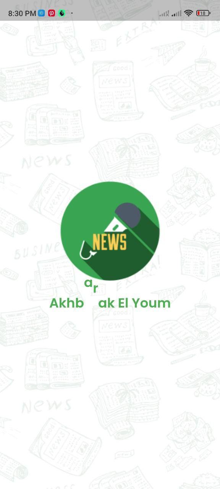
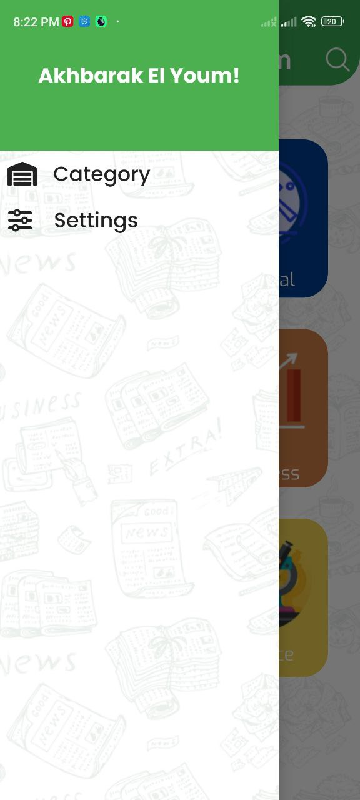

# akhbarak_el_youm

Developed a news app that connects to APIs to show users all news based on the category, such as sports, business, and science.
Implemented a dark mode option to allow users to change the appearance of the app.
Used APIs to fetch data from news sources, such as BBC, CNN, and The New York Times.
Categorized news articles into different categories, such as sports, business, science, and entertainment.
Allowed users to search for news articles by keyword or category.
Allowed users to save news articles to read later.
Allowed users to share news articles with friends.

| Splash Screen | Home Screen                       |
|------|-------------------------------------------|
||  |
| News Screen | Drawer                       |
|  |  |
| Search Screen | Search Screen                       |
|  |  |

